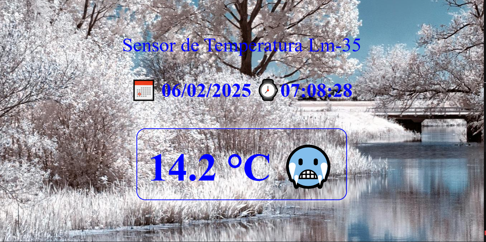
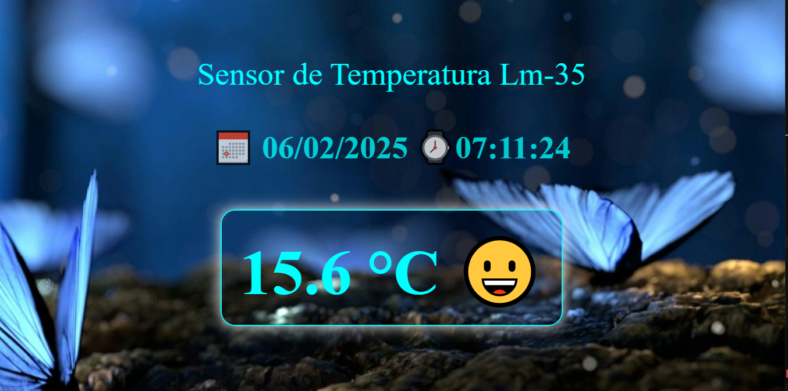
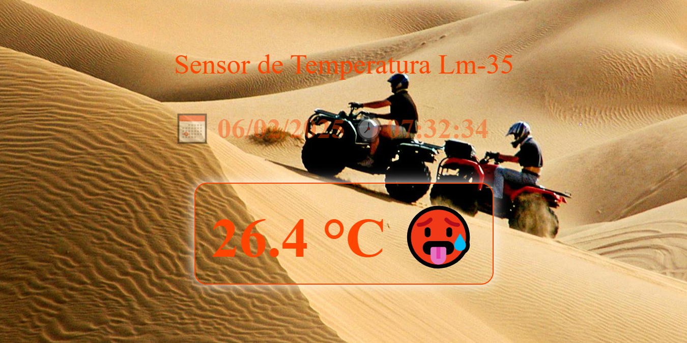
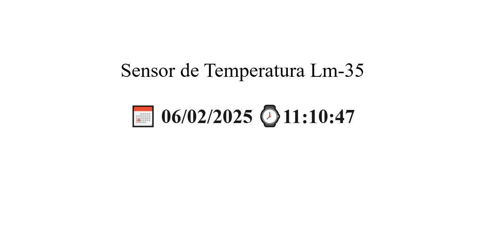

# Termometro digital Arduino-Node

La aplicacion muestra un termometro digital,
calendario y reloj digital. El termometro utiliza el sensor de temperatura LM-35.  

La comunicación de datos del termometro es recogida desde el puerto serial(USB) y que es enviada dede arduino Uno. 

La desconexión del puerto USB ó la no conexión del arduino bloqueará la aplicación y tendrá que reestablecer de nuevo la aplicación. 

La aplicación es lanzada desde el terminal con el siguiente comando: 
<em><b>"npm start"</b></em> (ver el archivo package.json).  

La pantalla de inicio o de entrada, es dependiente de la temperatura y está dividida en cuatro frajas de temperatura que son las siguientes:  

- temperatura < 15 grados Celsius
- temperatura < 25 grados Celsius y > de 15 grados Celsius.
- termeratura < 30 grados Celsius y > de 25 grados Celsius.
- temperatura > 30 grados Celsius.  

## vista pantalla < 15 grados Celsius: 

## vista pantalla temperatura < 25 grados Celsius y > de 15 grados Celsius. 

## vista pantalla termeratura < 30 grados Celsius y > de 25 grados Celsius. 

 
## vista pantalla temperatura > 30 grados Celsius. 

## vista pantalla desconexión USB arduino 

despues de ver esta pantalla tendra que reiniciar la aplicacion de nuevo.